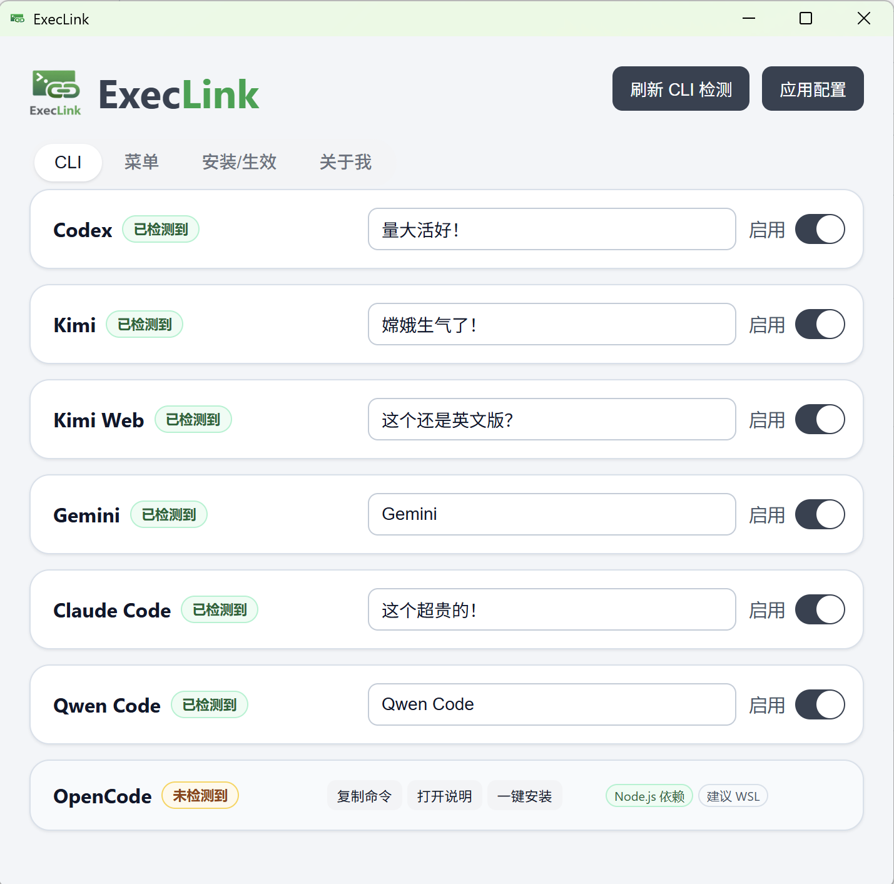

# ExecLink

ExecLink 是一个 Windows 右键菜单增强工具，用于快速启动常见 AI CLI（Tauri v2 + React + TypeScript + Rust）。

## 界面预览



## 核心能力

- 检测 CLI 可用性：`claude` / `codex` / `gemini` / `kimi` / `kimi_web` / `qwencode` / `opencode`
- 顶部入口支持 `刷新 CLI 检测`、动态前置依赖安装按钮与 `应用配置`
- CLI 页支持拖拽排序、自定义显示名、启用/禁用右键菜单项
- 已检测到 CLI 时支持 `登录`、`升级`、`卸载` 与 `加入环境变量`
- 未检测到 CLI 时支持 `快速安装向导`、`仅执行安装`、`复制安装命令`、`打开安装说明`
- `配置` 页包含 `右键菜单状态`、`迁移与清理`、`Windows 11 经典菜单开关`、`运行与安装策略`
- 支持 Explorer 刷新、legacy 菜单迁移、菜单扫描与旧残留清理
- `Windows 11 经典菜单开关` 作为系统级设置独立暴露
- Rust 直写 HKCU 注册表：无需额外安装 Nilesoft
- 默认终端运行器：`Windows Terminal (wt)`
- 关于页支持一键复制基础信息

## 使用说明（按页面）

### 1. 顶部入口与首次操作

- 点击窗口右上角 `?` 可随时打开“使用说明向导”。
- 建议首次使用、安装完新 CLI 或卸载 CLI 后，先点击 `刷新 CLI 检测`，确认页面状态与本机环境一致。
- 如果顶部出现 `安装前置环境`、`安装 Git` 或 `安装 Node.js` 按钮，说明当前机器缺少对应依赖；先补齐这些前置项，再继续安装 CLI 会更稳定。
- `应用配置` 会把当前 CLI 开关、顺序、自定义显示名、右键菜单分组名称和菜单总开关统一写入右键菜单。

### 2. CLI 页怎么用

- 已检测到的 CLI 卡片支持拖拽排序；右侧输入框用于修改最终显示名称，开关用于决定该 CLI 是否出现在右键菜单中。
- 已检测到的 CLI 还可执行 `登录`、`升级`、`卸载`；如果出现 `加入环境变量` 操作，说明该命令目录还没有加入当前用户 PATH。
- 未检测到的 CLI 可使用 `快速安装向导`、`仅执行安装`、`复制安装命令`、`打开安装说明`；带 `Node.js 依赖` 标签时，表示该 CLI 依赖 Node.js 与 npm。
- Kimi / Kimi Web 的 `快速安装向导` 会经过 `uv / Python / Kimi` 多阶段安装；向导期间会隐藏内置终端，但失败时可展开详情和日志继续排查。

### 3. 配置页怎么用

- 顶部 `右键菜单分组名称` 用于修改资源管理器中的父级菜单标题；旁边的总开关用于整体启用或关闭 ExecLink 右键菜单。
- `右键菜单状态` 用于查看当前菜单是否已应用、当前分组、生效作用域和 legacy 残留，并提供 `刷新状态`、`通知 Explorer 刷新`、`Explorer 兜底刷新`。
- `迁移与清理` 用于迁移旧版 PowerShell HKCU 菜单、删除当前菜单、清理旧残留，并通过 `菜单扫描结果` 扫描或删除已安装分组。
- `Windows 11 经典菜单开关` 是当前用户级系统开关，会影响整个资源管理器右键菜单，不只影响 ExecLink。
- `运行与安装策略` 用于调整终端运行器、uv 安装源策略和安装超时。

### 4. 生效方式与排障

- 点击 `应用配置` 后，请在资源管理器空白处右键验证菜单是否出现；修改顺序、显示名、开关或分组名称后，都需要重新应用一次。
- Windows 11 当前仍以经典菜单层为准；如未直接看到 ExecLink，请使用 `显示更多选项` 或按 `Shift+F10` 打开经典右键菜单。
- 如果菜单没有立即刷新，先到 `配置` 页展开 `右键菜单状态`，依次尝试 `通知 Explorer 刷新` 和 `Explorer 兜底刷新`。
- 如果检测到旧分组、legacy 残留或需要整体清理，可到 `迁移与清理` 处理。
- 如果切换了 `Windows 11 经典菜单开关` 但没有立刻生效，通常需要刷新 Explorer 或重新登录。

## 技术栈

- Frontend: React + TypeScript + Vite
- Desktop: Tauri v2
- Backend: Rust

## 目录说明

- 前端源码：`src/`
- Tauri/Rust 源码：`src-tauri/`
- 文档：`docs/`
- 运行时数据（本机）：`%LOCALAPPDATA%/execlink/`
  - 兼容自动迁移旧目录：`%LOCALAPPDATA%/AI-CLI-Switch/`

## 安装依赖（Windows）

ExecLink 当前安装链路依赖以下环境：

- `winget`（App Installer，前置检测项）
- Git for Windows
- Node.js（含 npm）
- Kimi Code CLI（通过 `uv` 安装）
- Python `3.13`（Kimi 安装流程中会安装/校验）

说明：

- 安装流程会先检测 `winget`；若缺失，推荐先安装 Microsoft Store 的 App Installer。
- 因为 CLI 使用时可通过 Python 脚本执行任务，建议先安装 Kimi Code（会带齐 uv + Python 3.13 路径）。
- 如果你只需要 Python 环境，不需要 Kimi Code，可在安装完成后卸载 `kimi-cli`。
- 除 Kimi 与 Claude Code 外，其他 CLI 在本项目默认采用 npm 全局安装。

## 推荐安装顺序

1. 安装/确认 `winget`
2. 安装 Git for Windows
3. 安装 Node.js（含 npm）
4. 安装 Kimi Code（uv + Python 3.13）
5. 安装其他 CLI（npm）

## 依赖安装命令

### 0) winget（App Installer）

检测：

```powershell
winget --version
```

若未安装，推荐 Microsoft Store：

- https://apps.microsoft.com/detail/9NBLGGH4NNS1

官方脚本安装方式（管理员 PowerShell）：

```powershell
$wingetBootstrapUrl = "https://aka.ms/getwinget"
$wingetBundlePath = Join-Path $env:TEMP "Microsoft.DesktopAppInstaller.msixbundle"
Invoke-WebRequest -Uri $wingetBootstrapUrl -OutFile $wingetBundlePath
Add-AppxPackage -Path $wingetBundlePath
```

### 1) Git for Windows

```powershell
winget install --id Git.Git -e --source winget
```

### 2) Node.js（含 npm）

```powershell
winget install OpenJS.NodeJS
```

### 3) Kimi（uv + Python 3.13）

```powershell
uv python install 3.13
uv tool install kimi-cli --python 3.13
```

仅保留 Python 环境时，可卸载 Kimi：

```powershell
uv tool uninstall kimi-cli
```

## CLI 安装命令总览

### Claude Code（官方命令）

```powershell
irm https://claude.ai/install.ps1 | iex
```

### Kimi / Kimi Web（uv）

```powershell
uv python install 3.13
uv tool install kimi-cli --python 3.13
```

### Codex

```powershell
npm install -g @openai/codex
```

### Gemini CLI

```powershell
npm install -g @google/gemini-cli
```

### Qwen Code

```powershell
npm install -g @qwen-code/qwen-code@latest
```

### OpenCode

```powershell
npm install -g opencode-ai
```

## Kimi / Git 完整流程文档

完整流程与镜像安装命令见：

- `install_kimi.md`

## 本地开发

前置依赖：

- Node.js 22+
- Rust（含 `cargo`）

安装依赖并启动：

```bash
npm install
npm run tauri dev
```

构建：

```bash
npm run build
npm run tauri build
```

## 恢复与清理

- `配置` 页中的 `右键菜单状态` 可查看当前菜单是否已应用，并执行 `刷新状态`、`通知 Explorer 刷新`、`Explorer 兜底刷新`。
- `配置` 页中的 `迁移与清理` 可迁移 legacy 菜单、删除当前 ExecLink 菜单、清理旧残留，并在 `菜单扫描结果` 中扫描或删除已安装分组。
- `配置` 页中的 `Windows 11 经典菜单开关` 是系统级设置，仅在需要切换 Win11 经典菜单层时使用；切换后可能需要重新登录。

## 许可证

MIT License，详见 `LICENSE`。
